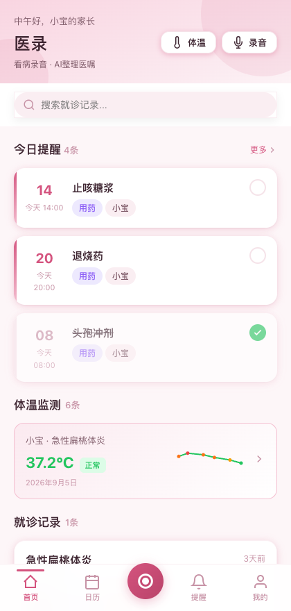
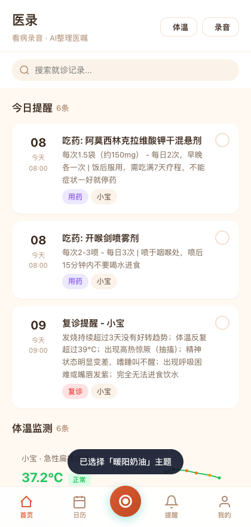
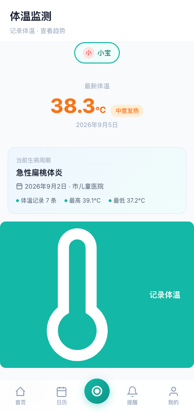
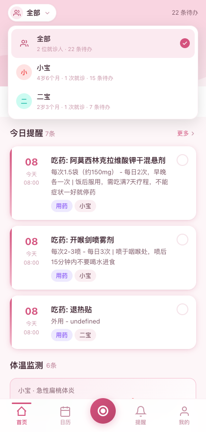
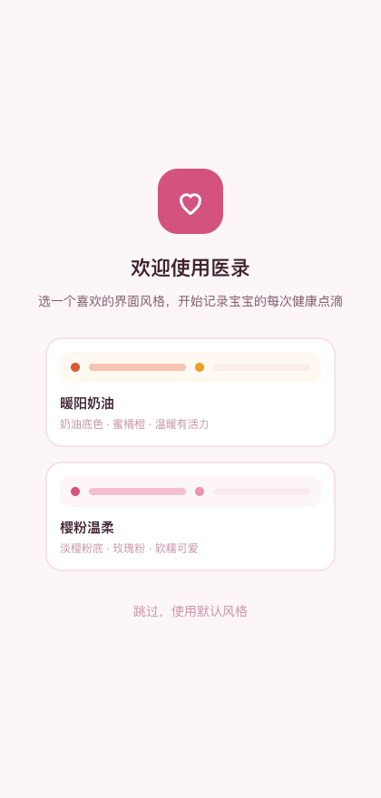

# 医录 · 看病录音助手 🏥🎙️

> 带娃看病时，一只手抱娃、一只手挂号，哪还有空记医嘱？
> **医录**帮你把大夫说的每一句话录下来，AI 自动整理成一份清晰的结构化就诊记录。

**⚠️ 本项目仍在持续优化中（Active Development），功能与界面会不断迭代，欢迎 Star 关注进展，也欢迎 Issue / PR。**

---

## 📸 界面预览

| 首页 · 樱粉温柔主题 | 首页 · 暖阳奶油主题 |
|:---:|:---:|
|  |  |

| 体温监测 · 生病周期关联 | 多就诊人一键切换 | 首次启动引导 |
|:---:|:---:|:---:|
|  |  |  |

---

## 💡 为什么做这个

带孩子去医院是每个家长的"高频刚需场景"，但也可能是最狼狈的场景：

- 医生说得快、信息密度大，抱着娃根本腾不出手记笔记
- 回家就忘：药怎么吃？观察什么症状？什么时候复查？
- 生病周期长（比如扁桃体炎要跟踪 1-2 周），体温、用药情况散落在各处
- 家里两位大人轮流带娃，信息不同步

**医录 = 录音 + AI 整理 + 结构化沉淀 + 全家共享**，把一次就诊的完整信息留档，让后续护理和复诊有据可依。

## ✨ 核心功能

### 🎙️ 一键录音 + AI 结构化整理
- 就诊时一键录音，事后 AI 五步处理：语音转文字 → 语义结构化 → 医嘱提取
- 自动归类到 **9 大医嘱分类**：病因 / 症状 / 用药 / 护理 / 饮食 / 注意事项 / 观察症状 / 预防 / 复诊

### 🌡️ 体温监测
- 快速记录体温，**自动关联当前生病周期**（14 天窗口内智能匹配）
- SVG 趋势图直观展示体温变化
- 支持事后把"孤立体温记录"手动补关联到就诊记录（单个 / 批量 / 新建就诊时自动填充）

### 📅 就诊日历
- 月历视图，就诊 / 用药 / 复诊**三色标记**，一目了然
- 按就诊人分别筛选查看

### 📷 病例上传
- 拍照或相册上传化验单、处方、检查报告
- Canvas 自动压缩，节省存储空间

### ⏰ 用药与复诊提醒
- 从就诊记录自动生成提醒，也可手动添加
- 今日待办智能排序：未完成 > 已完成，组内按时间升序

### 👨‍👩‍👧 多就诊人 + 家庭协作
- 支持配置多个就诊人（如大宝、二宝），**全局顶部一键切换**
- 首页、提醒、日历、体温等所有页面数据按就诊人隔离
- 家长身份设置（宝爸 / 宝妈），问候语个性化联动

### 🎨 双主题
- **暖阳奶油** / **樱粉温柔** 两套温馨主题
- 首次启动提供主题与身份引导选择

## 🛠️ 技术实现

| 模块 | 方案 |
|------|------|
| 架构 | 纯前端 SPA，零依赖、零构建，原生 HTML/CSS/JS |
| 数据存储 | localStorage，开箱即用、无需后端 |
| 录音 | MediaRecorder API |
| 图像压缩 | Canvas API |
| 图表 | 原生 SVG |
| 主题系统 | CSS Variables 双主题切换 |

**代码规模**：约 6500 行（HTML 137 / CSS 2922 / JS 3506）

## 🚀 快速开始

无需安装任何依赖：

```bash
git clone https://github.com/keepmomentum/medical-record-app.git
cd medical-record-app
python3 -m http.server 9123
```

浏览器打开 `http://localhost:9123`（建议使用手机模式体验，UI 为移动端设计）。

> 首次使用会有主题 + 身份引导页，之后在"我的"页面添加就诊人即可开始记录。

## 📱 iOS 原生 App

目标是发布 **Android + iOS 原生 App**。当前 Web SPA 是过渡形态，**iOS 端采用「Swift 原生壳 + WKWebView 复用现有 UI + 离线 ASR」**的混合架构。

- **离线语音识别**：[sherpa-onnx](https://github.com/k2-fsa/sherpa-onnx) (Apache-2.0) 通过 SPM 集成，iOS xcframework 预编译
- **统一 ONNX Runtime 底座**：未来 OCR 接入复用同一套协议
- **数据双写兜底**：Web 端 localStorage + 原生 SQLite 互为备份
- **Web 端零改造**：同一份代码在浏览器与 iOS App 中都能跑

详细见 [`ios/README.md`](ios/README.md) 与 [`docs/iOS技术方案规划.md`](docs/iOS技术方案规划.md)。

ASR 模型选型评测见 [`asr-poc/`](asr-poc/)（macOS 上一键跑通）。

## 🗺️ Roadmap（优化中）

- [ ] **iOS 端首发版**：M0 POC 已完成（脚本+模型+评测），待装 Xcode 后进入 M1 工程搭建
- [ ] Android 端
- [ ] 数据云端同步 / 导出备份（目前为本地存储）
- [ ] AI 转写与结构化能力接入更多模型（含端侧小模型）
- [ ] 就诊记录分享给家庭成员
- [ ] 疫苗接种与预防保健记录
- [ ] 病例 OCR 识别（化验单/处方结构化录入）
- [ ] PWA 离线支持

## ⚠️ 免责声明

本项目仅作为**个人就诊信息的记录与整理工具**，不构成任何医疗建议。用药、护理等决策请务必遵医嘱。录音前请注意遵守当地法律法规及医疗机构的相关规定。

## 📄 License

MIT
